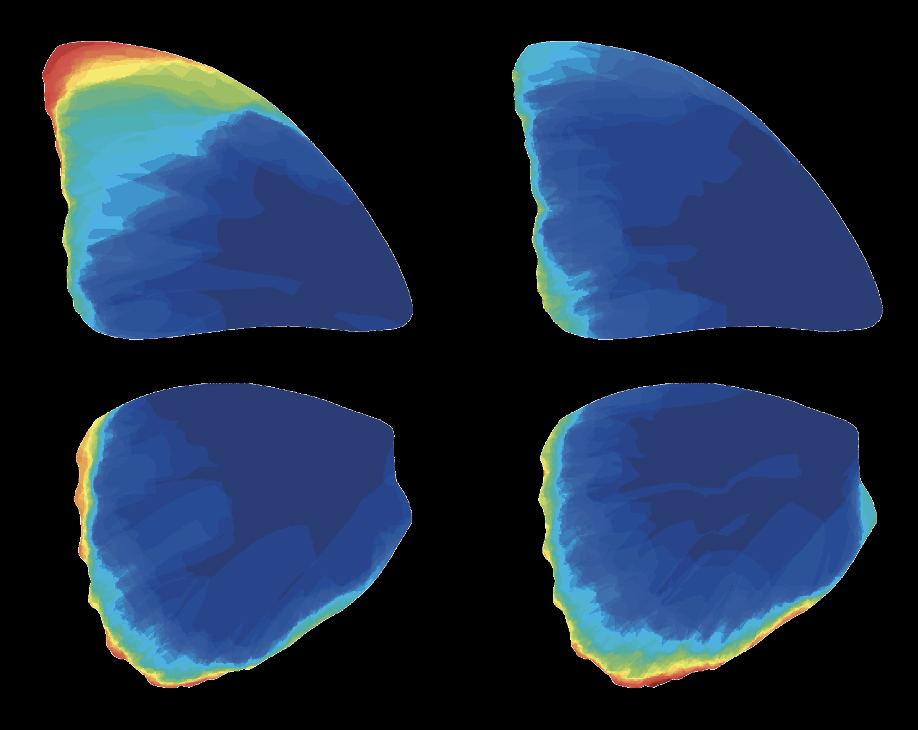

# Wing Damage Heatmap Generator

This R code allows generating heatmaps of wing damage frequency from image and morphometrics data.

## Features

- Automatically reads image and morphometric data
- Generates heatmaps showing frequency of wing damage
- Customizable color scales and resolution
- Suitable for insect wing studies and similar morphologies

## Input Requirements
