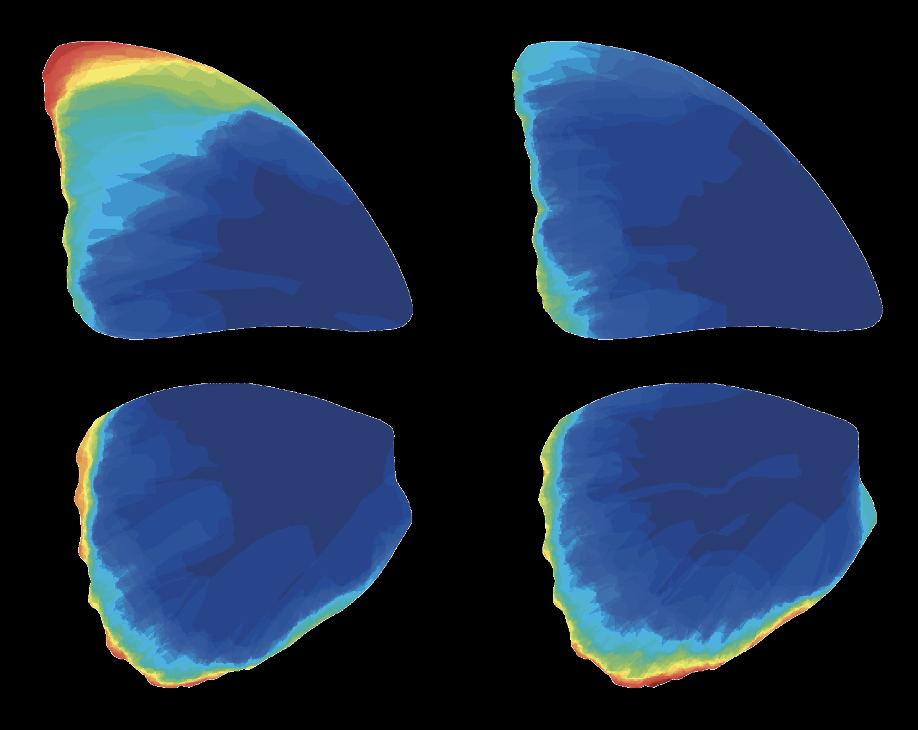

# Wing Damage Heatmap Generator

This R code allows generating heatmaps of wing damage frequency from image and morphometrics data.

  

Originally developed during my PhD (see https://journals.biologists.com/jeb/article/222/16/jeb204057/223419/Effects-of-natural-wing-damage-on-flight),
the code has been revised for clarity and reusability.

## Features

- Automatically reads image and morphometric data
- Generates heatmaps showing frequency of wing damage
- Customizable color scales and resolution
- Suitable for insect wing studies and similar morphologies

## Input Requirements

- Initial model images for building the heatmap for Forewings and Hindwings
- Folder of PNG Images for Heatmap Generation: the code goes through folders containing multiple wing images. Each image should show a single wing, with damaged areas marked in red (color value: 0.7294118).
